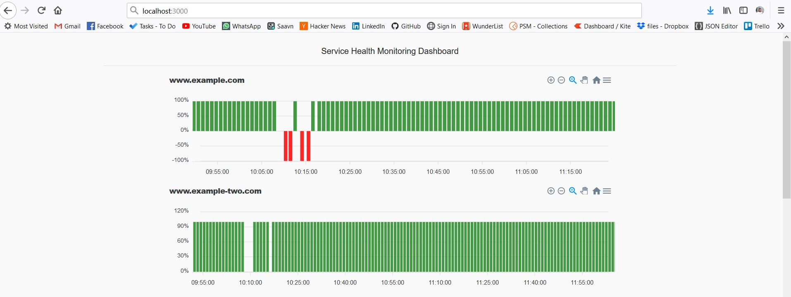

# Standalone Service Uptime Monitor

Standalone Real time Persistent service uptime monitor with built in dashboard.  



## Installation

Use the npm package manager [npm](https://www.npmjs.com/) to download node modules

```bash
git clone https://github.com/ranjithkumarmv/uptime-monitor.git
cd uptime-monitor
npm install
npm start
```

## Usage


To Add websites to Monitor update [config] file in the root folder of this repo.

SAMPLE CONFIG
```
{
  "servers": [
    {
      "uid":"ex-a",
      "name": "ExampleOne",
      "endpoint": "http://example.com/",
      "method": "GET",
      "timeout": 1
    },
    {
      "uid": "ex-b",
      "name": "ExampleTwo",
      "endpoint": "http://example.com/",
      "method": "GET",
      "timeout": 2
    }
  ]
}
```

### Application start command
```node
npm start
```
### Dashboard
Open Browser and hit
```bash
http://localhost:3000
```


## Contributing
Pull requests are welcome. For major changes, please open an issue first to discuss what you would like to change.


## License
[MIT](https://choosealicense.com/licenses/mit/)